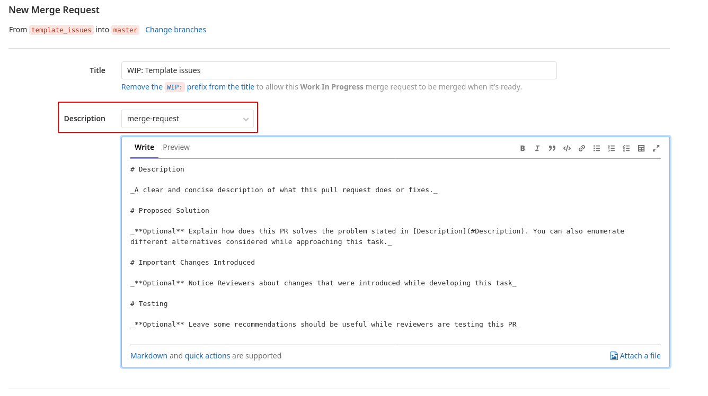
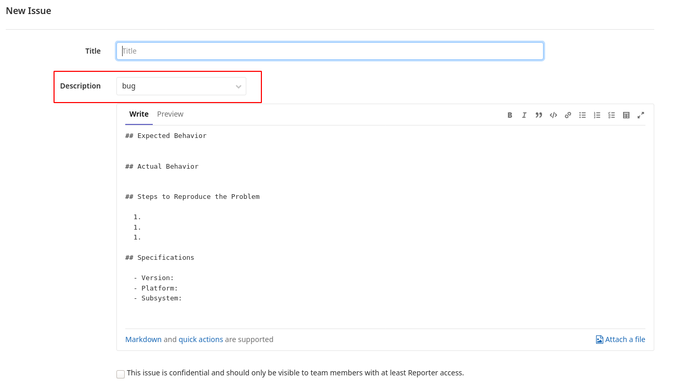

# Atix Docs 

Atix standard templates to be used in Gitlab.

## Getting Started

These instructions will get you a copy of the project ready to be used by Gitlab. 

### Prerequisites

_Note: This guide was made considering Gitlab as an example as it's our main tool. Files stated here will work with Github as well._

- [Gitlab Guide](https://docs.gitlab.com/ee/user/project/description_templates.html)
- [Github Guide](https://help.github.com/es/github/building-a-strong-community/configuring-issue-templates-for-your-repository)

### Installing

We suggest using `git subtree`. That being said, you can add the files manually and it will work as well.

1. Add the `docs` repository:

```
git remote add atix-docs git@gitlab.com:atixlabs/atix-docs.git
git subtree add --prefix .gitlab atix-docs master --squash
```

2. Link the `README` and the `CONTRIBUTING` files.

```
cp ./.gitlab/general/README.md ./
cp ./.gitlab/general/CONTRIBUTING.md ./
```

3. Edit the files and push the changes to your repository.

4. If you want to update and get latest `docs` changes, execute:

```
git fetch atix-docs master # update the reference
git subtree pull --prefix .gitlab atix-docs master --squash # pull the changes into our repo
```

### Using issues templates

Once you have pushed this changes to the repo you will be able to, when creating a merge request or an issue, to select any of the templates we have imported:





## Releasing a new version

We use [standard-version](https://github.com/conventional-changelog/standard-version) to automatically generate the changelog and bump the version.

When releasing a new version, execute:

```
npx standard-version
```

## Contributing

Please read [CONTRIBUTING.md](./general/CONTRIBUTING.md) for details on our code of conduct, and the process for submitting pull requests.

## Versioning

We use [SemVer](http://semver.org/) for versioning. For the versions available, see the [tags on this repository](https://gitlab.com/atixlabs/atix-docs-templates/-/tags). 

## License

This project is licensed under the MIT License - see the [LICENSE.md](LICENSE.md) file for details
