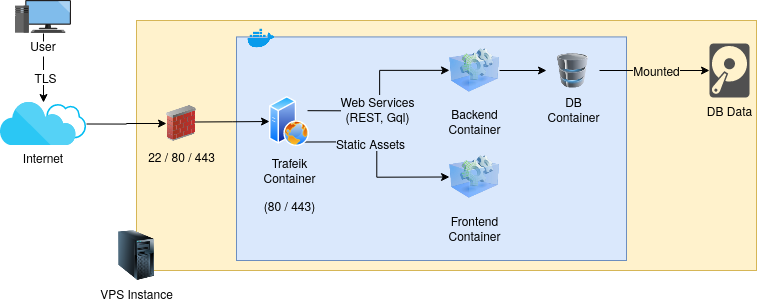

# Deploying the Apps

## Architecture



## Docker Compose

We use Docker Compose as a tool to run multi-container applications. We rely on it's over-ssh command execution functionality to connect to the VPS instance and execute the deployment steps.

The following containers are started:

- Backend:
  - The backend should be _dockerized_ and the image should be properly tagged and pushed to Atix's private Docker registry.
  - It should not hold any state (i.e. user sessions)
  - If it handles file uploads, there should be a host mapped volume.
  - It must expose the port that will be used by the proxy to redirect the traffic.
  - The domain should be the one stated in [Pre-requisites Section #2](./remote-setup.md/#prerequisites)
- Frontend:
  - The frontend should be _dockerized_ and the image should be properly tagged and pushed to Atix's private Docker registry.
  - It must expose the port that will be used by the proxy to redirect the traffic.
  - The domain should be the one stated in [Pre-requisites Section #2](./remote-setup.md/#prerequisites)
- Web Proxy:
  - Trafeik is being used as it handles auto-update Let's encrypt tls certificates and it has an excellent docker integration (each exposed port, if specified, will be auto-configured to receive traffic.)
  - All the communications should be HTTPS / TLS no matter the environment.
  - If possible, no config files should be used and everything should be configured using commandline arguments.
- DB:
  - Any DB can be used but only official images should only be configured
  - User and password should not be hard-coded.
  - The Data should be stored on a mapped volume to help backup process and allow container recreation process if required.
  - Port should be mapped to the host so the team can connect to it to do maintenance, troubleshooting or other task required. This is not unsafe as the machine is protected using `ufw` so this port will only be accessible using ssh port redirect.
- Monitoring:
  - Cadvisor was chosen to monitor docker and resources utilization.
  - It can be accessed only using ssh port redirect.
  - **Keep in mind that this is a basic monitoring schema as it's running on the same machine as the apps (using the same resources). It might not be responsive if a problem is happening on the server (like CPU exhaustion). Other tools like DataDog should be considered for production environments.**

The following considerations should hold for all the app containers and images we create (**Again, please refer to the examples provided in this repository before creating your own version**):

1. Them must not hold any kind of state. Everything should be stored in the DB, on an external service or a docker mapped volume.
2. We should be able to destroy and restart the containers without the risk of facing data loss (see the previous item).
3. We must use the **exact same images** no matter the environment we are deploying to. **Staging and UAT images should work in production as well.** We can introduce any kind of switched and configurations (environment variables, mapped config files, etc) to be able to do so.

### Environment based overrides

There are cases where some environment specific deployment configs are required. For example:

- Monitoring won't be enabled for dev environment
- In production, no self hosted DB will be used

For such cases, [multiple compose files](https://docs.docker.com/compose/extends/#multiple-compose-files) can be used. To do so, simply create a file named `docker-compose-overrides.yml` in the corresponding environment `docker` folder. For example, yo add monitoring to the UAT environment, create a the following file `uat/docker/docker-compose-overrides.yml` and it will be picked automatically when deploying.

### Workflow Sample

1. Work on you features as usual.
2. Once merging to `develop` branch, some checks will be ran (like unit or integration tests) on your repo and if everything is ok, a new image tagged with the version configured in the project (for example `package.json` or `pom.xml`) and the commit short-id will be pushed to Atix Docker Registry.
3. If you are ready to release a version, after merging to `release/x.y.z`, don't forget to update the versions accordingly.
4. If you are ready to deploy, update `docker-compose-base.yml` file to target the desired versions and push the changes.
5. That will allow you to execute a manual deploy. To do so, go to the `jobs` section in the Gitlab Repo and click on the ▶ button.
6. The app will be deployed to the desired environment.

For example (as a simplification `app` is used to refer to the backend and the frontend images):

1. We are working on our next version, `0.1.0`. Several commits have happened so you will see tags like `app:0.1.0-aeb11123` and `app:0.1.0-deadbeaf`
2. We are ready to release a new version so we create a branch `release/0.1.0` based off `develop`.
3. We change `develop` version to `0.2.0` (or whatever version you think is correct).
4. We update the `docker-compose-base.yml` to use `app:0.1.0-deadbeef` and deploy changes to `staging`.
5. QA has found an issue, we fix it in the branch `release/0.1.0` and push it. A new image will be created `app:0.1.0-aaaabbbb`.
6. We update the `docker-compose-base.yml` to use `0.1.0-aaaabbbb` and deploy changes to `staging`.
7. If everything is ok, we deploy the same version (`0.1.0-aaaabbbb`) to `uat`
8. If there is an issue found in `uat`, we fix it and push the changes, resulting in a new image `app:0.1.0-ccccdddd`.
9. We update `docker-compose-base.yml` to taget `app:0.1.0-ccccdddd` and deploy it to `staging`.
10. If it's ok in `staging` we deploy it to `uat`
11. If everything is ok, we merge to master and deploy to `production`.

## Scripts

All the bash scripts included in this directory are supposed to be short and self explanatory. Please read them if you want to understand how do they work. Most of the time is just defining some values using the environment type (staging, uat) as parameter.

```
Valid commands
  --config-server $environment  # Executes ansible playbooks on the remote server
  --deploy $environment         # Deploys the app to $environment
  --destroy $environment        # Invokes docker-compose down to destroy the $environment
  --restart $environment        # Restarts all the containers in $environment
```

_Note: you can modify this script locally and add as many custom tasks as you need to._

## FAQ

**Q:** Can I use the same tools to launch a local environment for development purposes? For example, I want to work on frontend related tasks without the need to install the backend framework and the db?

**A:** First of all is important to determine what backend version do you want to use. You can see all the deployed version in our [docker registry](https://docker.atixlabs.com). Let's assume we picked latest development version. The project is named `theproject` and the image `theproject-back:0.1.0-deadbeef`. What you need to do is:

1. Update `docker-compose-base.yml` in order to put the `theproject-ack:0.1.0-deadbeef` version
2. Execute:

```
$ cd ops/docker
$ ./deploy.sh "development"
$ docker inspect $theproject_backend_1 | grep IPAddress
>             "SecondaryIPAddresses": null,
            "IPAddress": "",
                    "IPAddress": "172.20.0.4",
```

Now, you will be able to query the backend by configuring your frontend to connect to `http://172.20.0.4:8080/` as a base url.

If you want to destroy the environment, just execute:

```
$ cd ops/docker
$ ./destroy "development"
```

---

**Q:** When are the builds triggered for each project?

**A:** Builds should only be triggered when something is pushed to `develop`, `release/x.y.z` and `hotfix/xxxxx`.
