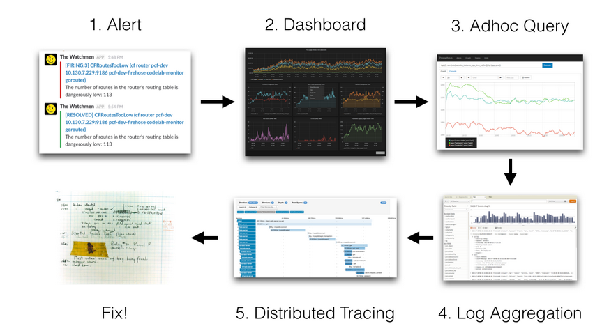
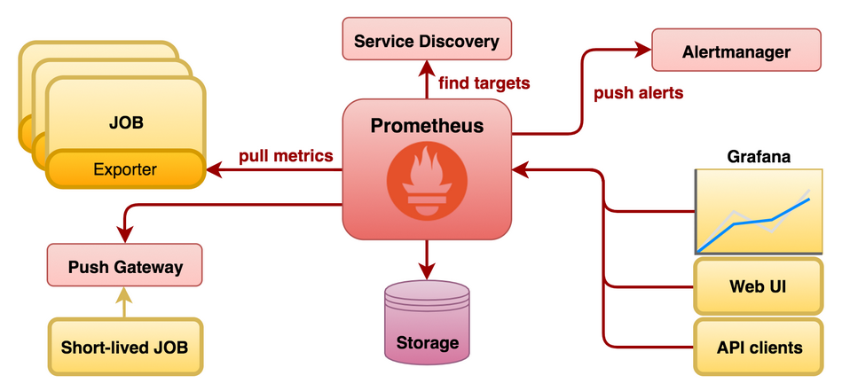
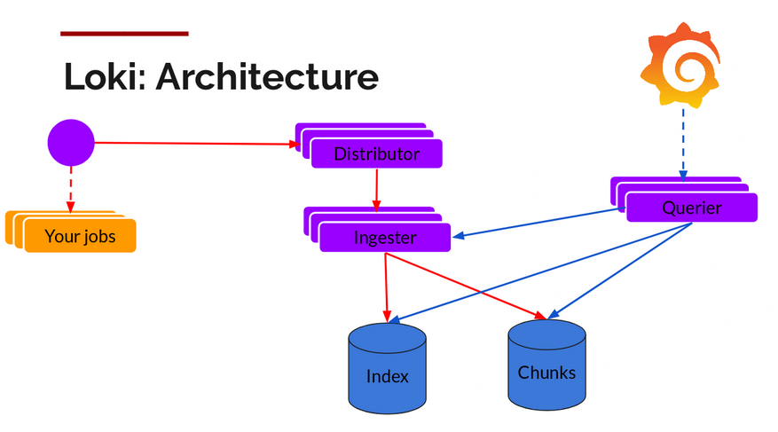

# Monitoring

Server side monitoring is an essential part of our CD workflow. It help us:

- Detect when an error is happening before the users and our customers.
- Understand current errors, troubleshoot and fix the errors before the issue escalates.
- Analyze errors that happened in the past in order to fix and improve whatever is required in order to avoid them happening again.



## Stack

The following constraints were considered when selecting our monitoring tools:

1. It should be easy to setup and integrate it into our apps.
2. We must be able to collect a small amount but extremely important server and app information. What we usually call, golden metrics:
  a. Server: CPU, memory, FS
  b. App: error rate, request per unit of time, endpoints response time, jobs and processes execution errors.
3. We must be able to setup alerts based on specific events and notice all the team members. Alerts should work, at least, over email.
4. Everyone on the team should be able to get access to the dashboards.
5. Store application logs that could be used to troubleshoot the app.

We decided to choose Prometheus (monitoring) + Loki (log aggregation) + Grafana (dashboards and alerts). The reasons are:

- It has turned to be quite standard in the industry therefore, there are a lot of examples, tutorials, configuration tips that can be easily found.
- It's easy to setup and the proposed architecture is sound.
- There are a lot of libraries and integrations ready to be used and work out of the box (i.e. Spring's Micrometrics comes with a Prometheus exporter).
- All the tools are open source. 
- Even though we will be using them as SaaS (cloud version) we are not locked-in and we can easily migrate to an on-premise scheme.

## Architecture

// FIXME: Insert proper diagrams here




Both Prometheus and Loki work on a pull based model:

1. Everything that's going to be monitored needs to exposed. This can be provided either by the apps or some specific exporters.
2. Distributors will be running and periodically will query for the information.
2. Distributors will store, filter and deduplicate the information.
3. On a fixed rate basis, the information will be pushed by the exporter to the storage (in our case, a cloud based one).

We will be running several tools to let our data reach prometheus and loki servers. It's important to mention that there is already a docker compose file that will deploy and configure them:

- [Node Exporter](https://github.com/prometheus/node_exporter) to read and provide machine metrics (CPU, memory, FS).
- [CAdvisor](https://github.com/google/cadvisor) will export containers metrics (CPU, memory, etc).
- [Promtail](https://github.com/grafana/loki/tree/master/docs/clients/promtail) to read, deduplicate, parse and export application logs.
- Custom app exporters to expose specific metrics we care about:
  - Java / Spring: 
    - [Micrometer Prometheus exporter](https://micrometer.io/docs/registry/prometheus) for Java-Spring
  - NodeJs:
    - [Prom Client](https://github.com/siimon/prom-client) for NodeJs based apps
    - // FIXME: add specific exporters for restify
  - MeteorJs:
    - [Our custom]() integration // FIXME: Link needed

## Deploying the exporters and distributors

### Configs

There are two required configuration files to make monitoring work:

- `prometheus.yml` ([example](../examples/monitoring/configs/prometheus.yml)): configuration about what metrics to scrap and where to send them to. 
- `promtail.yml` ([example](../examples/monitoring/configs/promtail-config.yml)): log processing configuration file.

**Important notes about this files**:

- Don't forget to replace the redacted credentials with proper ones.
- Change all the jobs names and filepaths in order to reference to your project name so it can be searchable in Grafana.
- Never push this files to your repo as they contain sensitive information (prometheus and loki credentials)
- You should execute `ops.sh --config-server $env` to copy them to the remote host.
- **The examples that can be found in this repo just work, think twice before introducing any change.**
- Promtail needs to access your app log files in order to parse them and push them to loki. In order to do so they will be mapped through a host shared volume:
  - Make sure your app is writing the logs in a mapped volume: host `/var/log/project/`.
  - You can either configure that in your `docker-compose-base.yml` or `docker-compose-overrides.yml`.
  - Change the Promtail config in `docker-compose-overrides.yml` to use the same volume.

### Docker Compose

In order to monitor an environment you need to deploy the before mentioned tools. To do so, you need to create the `docker-compose-overrides.yml` as explained in [Environment based overrides](./deploying-the-apps.md#Environmnet based overrides). Once that's done, monitoring will be enabled just by invoking a regular deploy without any further steps, just run `ops.sh --deploy $env`.

You can find [development](../examples/monitoring/docker-overrides/docker-compose-overrides-development.yml) and [production ready](../examples/monitoring/docker-overrides/docker-compose-overrides.yml) examples pushed to this repo. _Do not forget to search and replace `projectChangeMe` and put your project's name._

If you already have some other overrides (for example if you are not running a service in UAT like a DB but you are in staging), just append the contents of the example files and it should work out of the box.

### Checking your deploy

After deploying, you should be able to access to both prometheus and promtail status pages. To do so:

- Prometheus: 

```
1. ssh app@your-server -L9090:localhost:9090
2. Open http://localhost:9090/targets in your browser
3. Three targets should have STATE = 3: Cadvisor, Node Exporter and your App.
```

- Promtail:

```
1. ssh app@your-server -L3100:localhost:3100
2. Open http://localhost:3100/targets in your browser
3. A single target should be shown marked as Ready 
```

## Grafana

### Configuration

1. Access [Grafana](https://atixlabs.grafana.net/dashboards) with your credentials.
2. Create a new folder for your project.
3. Click on import to preload the JSON templates that can be found [here](../examples/monitoring/dashboards). Rememer we will all be pushing data to the same agggregation server so don't forget to edit them and put your project's jobs name before importing so you can filter your own information.
4. Your dashboard should be displaying your server's realtime information.

### Monitoring

Once you finished the configuration step, you will be able to see two different dashboards:

1. Will help you understand Server and App status.
2. Will provide you information about logs.

**Please be sure you undersand both of them as you will be using them to troubleshoot your app**

### Exploring the data

Besides the predefined dashboard, Grafana provides a tool named _Explore_ where you can put the same queries as you would for a dashboard but just to get information you don't need to be permanently configured. There are two ways to access to it:

1. Access from an already existing dashboard panel by clicking on any dashboard panel title > explore
2. Navigating to [explore](https://atixlabs.grafana.net/explore).

You can learn about how to filter information from:

- https://github.com/grafana/loki/blob/master/docs/logql.md#filter-expression
- https://prometheus.io/docs/prometheus/latest/querying/examples/
- https://prometheus.io/docs/prometheus/latest/querying/examples/

### Alerts

- Alerts are configured within each panel.
- Before configuring an alert, setup the notification channel (who is going to receive the alert and where) [here](https://atixlabs.grafana.net/alerting/notifications).
- An Atix email distribution list should be crated to send the alerts to.1

## FAQ

**Q:** Why is this so complex and has so many steps? 

**A:** It might look cumbersome the first time you read it. Keep in mind this is a detailed description about how everything works but you don't need to understand everything if you are just going to use an already configured monitoring setup. **Also, this is a one time task, once it's done in you project, you don't need to execute any of the steps again!** 

***

**Q:** How can I get a grafana user? 

**A:** Just ask for it to your TL and he will provide it to you.

***

**Q:** Are we all going to share the same Grafana instance? 

**A:** Yes, that's why you need to be very careful when naming your jobs. 

***

**Q:** How can I create a distribution list to send alerts to? 

**A:** Ask your TL and he will make sure to get one for you.

***

**Q:** Can we receive notifications over slack? 

**A:** Yes, just ask your TL to get the proper configs for you. 